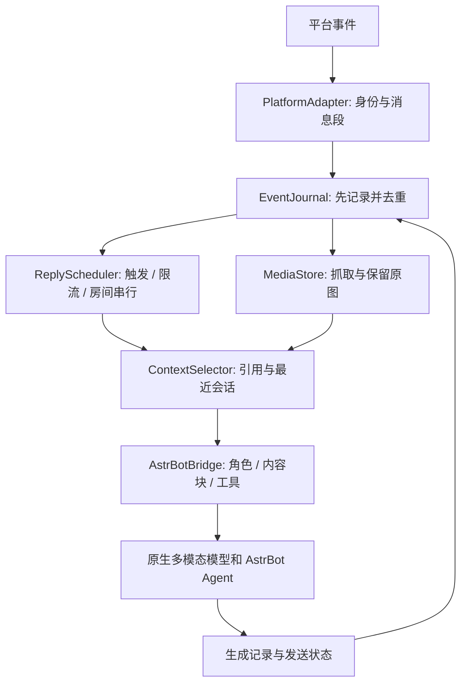

# 多模态群聊设计

状态：原始设计基线。v2.0.0 的已实现范围、调整与验证见 [实现记录](MULTIMODAL_RELEASE.md)。2026-10-02。

基线：上游 `aa97e0e35a18733e73db753238dd2a3021446e42`；第一阶段适配 AstrBot `v4.28.2`、NapCat 群聊与原生图片输入。其他平台和 AstrBot 版本需要适配验收，不沿用旧 README 的最低版本承诺。保留上游署名与 AGPL-3.0 许可证。

## 1. 决策

将插件收敛为 **群聊消息记录器、上下文选择器、回复调度器**。图片理解、指代消解、语气和是否值得插话由模型完成；身份、消息顺序、附件生命周期、限流和工具执行由程序保证。

先做图片连续性，再删重复的语义判断。最终不依赖“图片先转文字”“平台先生成 caption”“等待文字描述落库”的链路。图片始终属于原始消息，在生成请求时作为真正的图片内容块发送。

“多模态”按模型和适配器分别声明能力，不能直接等同于任意音频、视频或文件输入。第一版只承诺文字和图片；语音、视频、文档以后按实测能力添加。

## 2. 已确认的问题与设计依据

此次排查在部署版本和当前上游 main 的隔离探针中复现了以下问题：

| 问题 | 代码依据 | 对设计的约束 |
| --- | --- | --- |
| 缓存主动清空图片引用，纯图片还可能变成空消息后被跳过 | [message_cache_manager.py](https://github.com/Him666233/astrbot_plugin_group_chat_plus/blob/aa97e0e35a18733e73db753238dd2a3021446e42/utils/message_cache_manager.py#L112-L130) | 先记录完整事件，再判断是否回复；不回复也要保留附件 |
| 老的群历史查询路径与当前核心存储作用域、内容格式不一致 | [上游历史适配](https://github.com/Him666233/astrbot_plugin_group_chat_plus/blob/aa97e0e35a18733e73db753238dd2a3021446e42/utils/platform_ltm_helper.py)、[AstrBot 群上下文](https://github.com/AstrBotDevs/AstrBot/blob/v4.28.2/astrbot/builtin_stars/astrbot/group_chat_context.py) | 用一个明确的 room key 和版本化事件格式；不要猜裸群号或依赖 caption 缓存 |
| 同条消息带图可正常形成图片请求；先发图再 @ 时图片请求数量变成零 | 真实模块隔离探针：原始缓存路径 0 张；仅保留缓存附件的对照路径 1 张 | 分开验证“传输层能看图”与“前序消息选入上下文” |
| 引用图片的修复不覆盖所有独立前序图片路径 | [PR 44](https://github.com/Him666233/astrbot_plugin_group_chat_plus/pull/44)、[PR 48](https://github.com/Him666233/astrbot_plugin_group_chat_plus/pull/48) | 引用解析与无引用的连续消息关联分别验收 |

现场日志、群成员信息和请求内容不提交到公共仓库。上述探针证明了插件的信息丢失路径；它们不等同于新架构的真实 QQ 端到端验收。

## 3. 功能取舍

### 可以删除或合并

| 现有功能 / 模块 | 新设计 | 删除条件 |
| --- | --- | --- |
| 图片转述 `image_handler.py`、`image_description_cache.py` | 主模型直接接收图片；删除 caption provider、caption 文本缓存 | 附件持久化和图片请求验收通过后删除旧链路 |
| 等待平台 caption、从 LTM 找图片描述 `platform_ltm_helper.py` | 自己记录原始消息与附件；LTM 只可用于明确版本的旧文本导入 | 不再把平台描述当实时图片来源 |
| 清洗 `[图片]`、`[多模态消息]` 等占位符来拼历史 | typed parts 转成原生内容块 | 不把占位符误当实际附件；无法恢复的旧记录标记缺失 |
| 情绪关键词、消息质量评分、读空气、多套主动判断 | 明确 @ 直接生成；自发参与最多一个统一语义门控 | 移除 `mood_tracker`、`message_quality_scorer` 的回复准入职责 |
| AI 调频、疲劳/注意力/回复密度的重叠评分 | 时间窗口、令牌桶、冷却等简单硬规则；语义交给统一门控 | 可保留作息窗口和硬限流，不再维护多套隐式分数 |
| 表情包情绪识别、反复生成表情描述 | 保留平台的“这是贴纸”元数据，图片原样给模型 | 不为情绪分类单独调一次模型 |
| 长篇工具使用提醒 `tools_reminder.py` | AstrBot 的真实工具 schema 和 persona 中少量必要规则 | 工具集合、权限和调用结果验证后移除重复说明 |
| 正则猜测/改写人格提示词 `system_prompt_rewriter.py` | AstrBot 负责人格、技能和工具；插件只追加稳定群聊规则 | 请求所有权与 hook 顺序确认后移除；不丢第三方扩展 |
| 错字模拟、打字延迟、拟人化字符串修补 | 首版不带；自然表达交给 persona | 不把发送延迟当作连续性实现 |
| 独立 Web 面板的大量配置入口 | 首版用 AstrBot 配置与诊断日志 | 不在上下文重构阶段同时重写面板 |

移除 caption 缓存不等于移除图片文件缓存。后者解决 URL 失效和历史可读取，是必要基础设施。

图片转述链路的删除直接来自原生视觉能力；情绪、质量等评分的合并来自通用 LLM 判断能力和职责去重，并不是只有多模态模型才能做到。

### 必须保留的工程能力

| 能力 | 原因 / 简化方式 |
| --- | --- |
| 下载、鉴权、临时 URL 刷新、MIME/大小检查、图片文件缓存 | 模型无法访问本机路径或自动恢复已失效 QQ 链接 |
| bot / 群 / 发送者身份、@ 和引用解析 | 昵称和消息文本不能作为身份依据 |
| 合并转发消息的拉取与有界展开 | 模型不能仅凭平台 message id 获得内容；展开后保留发送者和附件 |
| 去重、顺序、并发、回复调度、硬限流 | 防止重复触发、串群、同一触发重复发送 |
| 工具 schema、权限、调用 ID、完整 assistant/tool 轮次 | 多模态能力不能替代工具执行和状态管理 |
| 上下文预算、附件过期、摘要、存储清理 | 模型上下文和本地磁盘都有限 |
| 显式指令、管理员控制、群名单、静默时段 | 确定性开关，不交给模型猜 |
| 用户定义的精确过滤/替换规则 | 属于明确产品规则；与重复的 AI 质量预判分开 |
| 入群等平台事件 | 保留真实事件类型；欢迎措辞可交给模型 |

## 4. 模块与数据流

建议独立实现 `multimodal/`，先保留旧代码用于比对，不继续在 14,000 多行的 `main.py` 里叠补丁。新入口只负责接线；私聊不复刻第二套上下文逻辑。

| 模块 | 单一职责 |
| --- | --- |
| `platform_adapter.py` | 原始事件转内部格式；按需获取引用、转发内容 |
| `event_journal.py` | SQLite 事件、关系、生成轮次、发送状态；去重与序号 |
| `media_store.py` | 原始附件入托管目录、状态、租约、配额和清理 |
| `context_selector.py` | 围绕当前触发选消息，闭合引用、裁剪预算 |
| `reply_scheduler.py` | 触发、短批次、门控、每房间生成队列 |
| `astrbot_bridge.py` | 核心版本适配；请求组装、人格/工具保留、生成结果回收 |
| `diagnostics.py` | 事件到请求的可观测性，不默认记录原始提示词 |

## 5. 内部消息模型

`room_key = (platform_instance_id, bot_account_id, chat_type, chat_id)`。room key 和 event id 必须组合使用，平台 message id 不假设全局唯一。发送者始终是元数据，不把每个发送者拆成独立群聊历史。

`ConversationEvent` 的主要字段：

- `schema_version`, `room_key`, `event_id`, `seq`, `received_at`, `platform_timestamp`。
- `actor = {kind, id, display_name}`；只有通过 bot 账号身份验证的本 bot 生成才是 assistant。
- `parts`：保持原顺序的 `text / image / mention / reply / audio / video / file / forward`。
- `reply_to`, `batch_id`, `generation_id` 等关联字段；工具轮次单独保存真实协议角色与调用 ID。
- 附件 part 只保存 `media_id`；`MediaAsset` 保存来源、SHA-256、类型、尺寸、字节数、托管文件引用和状态。

事件内容不可变，附件状态与发送状态分别更新。状态为 `pending / ready / failed / expired`。即便图片还没下载完，也先落事件和 pending 引用；纯图片、纯 @、被概率/门控拒绝的消息都进入日志。

附件先使用临时 media id，完成下载后按内容哈希去重。磁盘存托管文件，日志存引用，不把 base64 反复写进 SQLite。存储路径使用 AstrBot 的插件持久化目录，不能依赖容器临时目录。

旧历史导入必须识别格式和来源。只有 `[Image]` 的记录表示“当时有图片，但原文件不可恢复”；不伪造 caption，也不宣称导入后模型能看到旧图。

## 6. 如何组织上下文

### 6.1 共享时间线，加当前话题的关联视图

每群维护一个共享时间线。每次请求以当前触发 `anchor_event_id` 为中心，选择相关消息；“最近群聊”“当前人的连续消息”“引用链”是同一日志的视图，不是三份可相互覆盖的历史。

请求保存 `snapshot_seq`：只能选入该触发确认时已到达的事件。生成期间的新消息留给后续批次，避免用户看到的回复对象和模型实际读取的对象不同。引用的旧事件可在作用域和保留期内补取，保留来源说明。

选取优先级：

1. 当前消息及当前附件，必须保留。
2. 明确引用的消息与附件，包括跨发送者引用；有界追溯引用链。
3. 同一发送者在短时间内、与本触发关联的连续消息和图片。默认关联窗口 120 秒；不要因为群里插入几条消息就丢图。
4. 当前话题的最近用户、assistant 和完整工具轮次。
5. 少量最近群聊背景，包含其他人的图片时仍保留各自发送者和消息位置。
6. 可选的较早事实摘要，优先级最低。

步骤 3 是强候选关联，不是假定一切“这个”都指向上次图片：显式引用优先，当前文字可以改变对象；多张候选图或多个人同时发图时，让模型基于带身份的时间线判断，无法确定就询问。

已回复的图片不从日志删除；热关联优先当前批次及最近未处理图片，后续继续询问可以通过引用、话题关联或近期上下文再次选入。图片过期时明确说附件不可用，而不是输出“你没有发图”。

### 6.2 用真实角色和内容块，不拼成一篇大作文

模型请求分四层：

| 层 | 内容 | 角色 / 来源 |
| --- | --- | --- |
| 稳定规则 | 框架人格、工具、少量群聊规则 | 框架 system；保留正常扩展 |
| 可选历史摘要 | 带覆盖范围和出处的旧事实，可能有误 | 普通数据块；不用它覆盖规则 |
| 被选中的时间线 | 每条消息含时间、发送者、message id、引用关系；图片跟在所属消息里 | 群成员是 user，本 bot 是 assistant，工具是 tool |
| 当前触发 | 当前发送者、@/引用信息、原始内容块 | 最后一条 user；只出现一次 |

群成员的名字、文本、其他 bot 的发言不会自动得到 assistant/system 权限。元数据通过固定格式转义后生成，不从用户文本里推断“这是系统消息”。模型判断“他”“这张图”依靠发送者和引用关系，不依靠图片集中放在全局 `image_urls` 后猜顺序。

例如 A 发图、B 插话、A @ bot 时，请求中保留 A 的图片 user 消息、B 的 user 消息、A 的当前 user 消息。无需把 A 的图改写成文字，或把整段历史粘到 A 的当前 prompt 里。

协议示例见 [multimodal-context.json](examples/multimodal-context.json)。示例图片是结构验证用的 1×1 PNG，不是视觉效果验收样本。

### 6.3 预算与长期记忆

初始建议值，需按实际模型计费与延迟测量调整：总输入预算 12,000 tokens；最近文本候选 40 条、时间窗口 10 分钟；每次最多 6 张图片（优先关联图，背景图最多 2 张）；单图最多 10 MiB；关联窗口 120 秒。模型或适配器的更小上限优先。

token 预算覆盖 system、工具 schema、摘要、文字、图片估算和当前输入，另为输出留出空间。图片不能按“URL 字符串长度”计费；适配器按尺寸和模型规则估计，再结合实际 usage 校准。不支持准确估计时使用保守额度。

先删旧背景，再删摘要，再缩小旧话题；当前消息与明确引用的核心附件受到保护。预算不足时停止加入背景。保护集合本身超过限制时明确报告附件/上下文过大，让用户选图，不能悄悄丢掉问题对象。

assistant 的 tool_calls、对应 tool 输出、完成回复按完整轮次保留或裁剪，不能产生孤立 tool 消息。裁剪后的跨界引用保留简短出处与“原文未选入”状态，不能编造内容。

首版不需要复杂长期记忆。后续可在预算压力时，对旧话题生成带 `source_event_ids` 的简短事实摘要；只记录明确事实、承诺和偏好。摘要不是永久替代原图的 caption，不把模型猜测升级为事实。必要时通过引用重新加载尚未过期的原图。

原图默认保留 24 小时；每房间软配额 256 MiB、实例总硬配额 1 GiB，均为起始建议。`ready` 图片被当前请求选中后持有租约，清理器不能在请求组装/执行中删除；超出总配额时优先回收无租约的旧文件，新附件失败需保留可诊断状态。日志元数据另有保留期；日志还在不代表附件仍可读。

## 7. 触发、批次和并发

明确 @、回复本 bot、指令走确定性路由，不调用额外“值不值得回复”模型。图片前序消息已经入日志，因此后面的 @ 不需要等待 caption。

纯 @ 可以开启同一发送者的小等待窗口，允许紧随其后的正文进入同一批次；默认批次最多等 1 秒，不能无限延期。关联附件 pending 时单独最多等待 3 秒，超时报告加载失败/仍未就绪，保留事件以便稍后重试。只等待依赖，不等待全群所有下载。

每房间一个生成队列，同一发送者尚未开始的连续触发可以合并；其他发送者各自保留 anchor。合并后以最终纳入事件的序号确定 snapshot。已经生成中的请求不原地改写上下文；新触发排队或按明确策略取消，不能改成另一个人的问题。

自发插话默认关闭，开启后才需要统一门控：先做静默时段、冷却和额度检查，再给模型同一份有界上下文，输出 `reply / ignore` 和目标事件 ID。不要为情绪、质量、疲劳、频率分别调用模型。

无工具、无即时流式发送的简单模式可以一次结构化调用同时决定与回答，验证 action 后才发送。完整 Agent/工具模式采用一次门控、一次正常生成，避免尚未决定参与就执行工具；不能承诺所有主动模式都是一次调用。明确 @ 模式没有独立门控调用，但生成本身可能含工具往返。

## 8. AstrBot 接口边界

参考 [v4.28.2 ProviderRequest](https://github.com/AstrBotDevs/AstrBot/blob/v4.28.2/astrbot/core/provider/entities.py)、[Agent 消息类型](https://github.com/AstrBotDevs/AstrBot/blob/v4.28.2/astrbot/core/agent/message.py)和 [主 Agent 构建](https://github.com/AstrBotDevs/AstrBot/blob/v4.28.2/astrbot/core/astr_main_agent.py)。

请求已有 `contexts`、`image_urls` 和 `extra_user_content_parts`，不需自定义图片 HTTP 协议。历史消息用 `contexts` 内原生 `text` / `image_url` 内容块；当前消息通过 `extra_user_content_parts` 表达有序内容块。

需要实现并验收的桥接契约：

1. 插件日志是群聊转录的唯一权威来源；框架 conversation 承载人格/Agent 状态和必要镜像，不维护另一套竞争的群聊历史。
2. 映射一个按 room key 隔离的框架会话，不能直接沿用按发送者区分的事件 UMO。保持事件原始 UMO 用于平台路由、权限和配置，不篡改全局 event 身份。
3. `build_main_agent` 在 `req.conversation` 存在时会从 conversation.history 重载 contexts。不能仅在创建请求时设 contexts 就认为会生效，也不能简单设 conversation=None 后丢失正常人格装配。
4. 在历史重载之后、请求序列化之前，使用本插件作用域的 `on_llm_request` 适配点替换受管理的转录。先以最小集成探针确认 v4.28.2 实际 hook 顺序、人格、工具和 KB 行为。不能假定任意负 priority 都是最终执行。
5. `prompt` 在框架前期保留当前可检索文字供 KB/记忆使用；最终组装时当前文字只在有序内容块中出现一次，受管理请求可以将 prompt 置空、使用非空 extra parts。必须验证该版本空 prompt、仅图片/仅 @、检索输入与序列化路径；不兼容时收窄适配或请求核心提供明确的最终上下文接口，不 monkeypatch 所有插件 hook。
6. 保留框架已经装配的人格、技能、工具及第三方新增内容。转录与扩展块分别标记来源；相同引用的重复图片按媒体身份去重。已知内置群 ICL 在启用 fork 的作用域关闭；不靠正则删除其他插件文本，也不重放整个旧群历史。首版兼容性按已验收的扩展方式声明：任意第三方若同样整体覆盖 contexts，不能承诺自动合并，需要明确上下文所有者或扩展接口。
7. 当前图片若已放进有序 extra parts，不再重复放 `image_urls`。历史图片的托管引用要在发送前解析成适配器接受的 data URI 或可访问链接；历史 contexts 中直接放本机路径不等于模型可访问。不要保存完整 wire payload 到框架历史。
8. Agent 的 assistant/tool 轮次作为规范化协议记录回写日志；装饰后发送内容另存发送记录。分段发送不把第一段误当全部生成回复，不把工具结果改写成 user 发言。

第 4–6 项是第一阶段的集成风险，需要用真实 SDK 路径验证后确定细节。这份设计没有声称新的桥接代码已经存在。兼容边界不清晰时应缩小支持范围，而不是恢复全局 hook 包装和提示词猜测。

## 9. 失败与发送状态

- 下载失败、链接过期、格式不支持分别记录原因；有图片事件和看到了图片是两种状态。
- 图片请求只能路由到图片能力已经验证的模型/适配器。备用模型也要满足能力；不静默退回纯文本或偷偷启用 caption。
- 请求失败不删除用户消息，不写入虚假的 assistant 成功回复。默认不自动反复重发同一失败请求；明确的限次重试策略才执行。
- 生成完成和发送完成分开落库，记录 `generation_id`、目标事件、最终文本及发送回执。回调去重能防止多数重复；平台无幂等发送接口时，崩溃在“已发送但未记回执”之间不能保证严格 exactly-once，状态记为 uncertain，默认不盲目补发。
- API 的内容拒绝不能由上下文组织保证消失；保留来源和选择记录便于查明具体输入，不自动删除原始消息或假装生成成功。

## 10. 配置和诊断

配置只围绕：启用群、图片模型、主动参与开关、输入/图片预算、关联窗口、批次窗口、附件等待、附件/日志保留、磁盘配额、冷却额度、静默时段。模型能力由适配器验证，不暴露一组可随意勾选却未实现的模态开关。

每个请求记录：room 的匿名标识、anchor、snapshot、选中的 event/media ID、选择理由、附件状态、实际图片数、预算、门控动作、模型 ID、耗时、生成/发送状态。默认不记录群原文、图片内容、完整 data URI 或凭据；本地调试抓包显式启用并限期清理。

首个诊断验收标准是：能够回答“某张图已接收、是否下载成功、为什么选入/没选入、请求实际含几张图”。不能只输出笼统的 All chat models failed。

## 11. 交付边界

本分支交付设计、示例和验收计划，未修改生产运行逻辑。下一阶段按 [实施计划](MULTIMODAL_PLAN.md)推进。新运行入口建议使用独立插件名 `astrbot_plugin_multimodal_chat`，切换时同一群只启用一个回复所有者，避免新旧插件同时触发。
